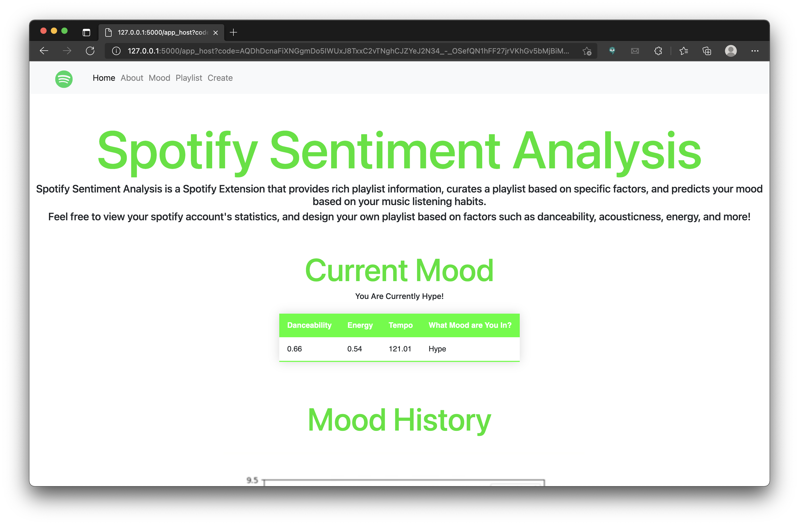
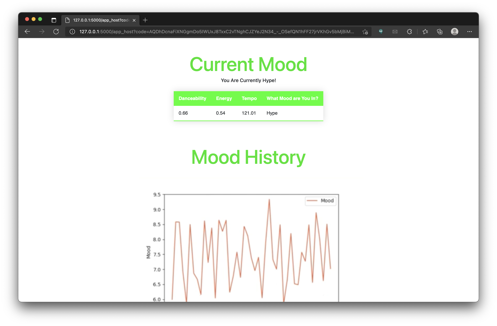
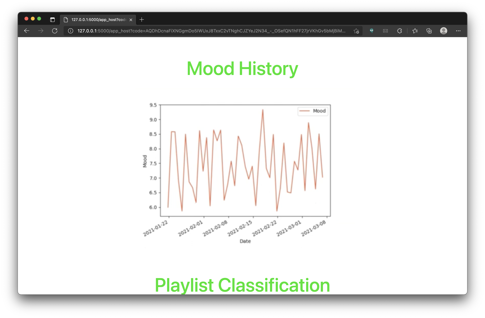
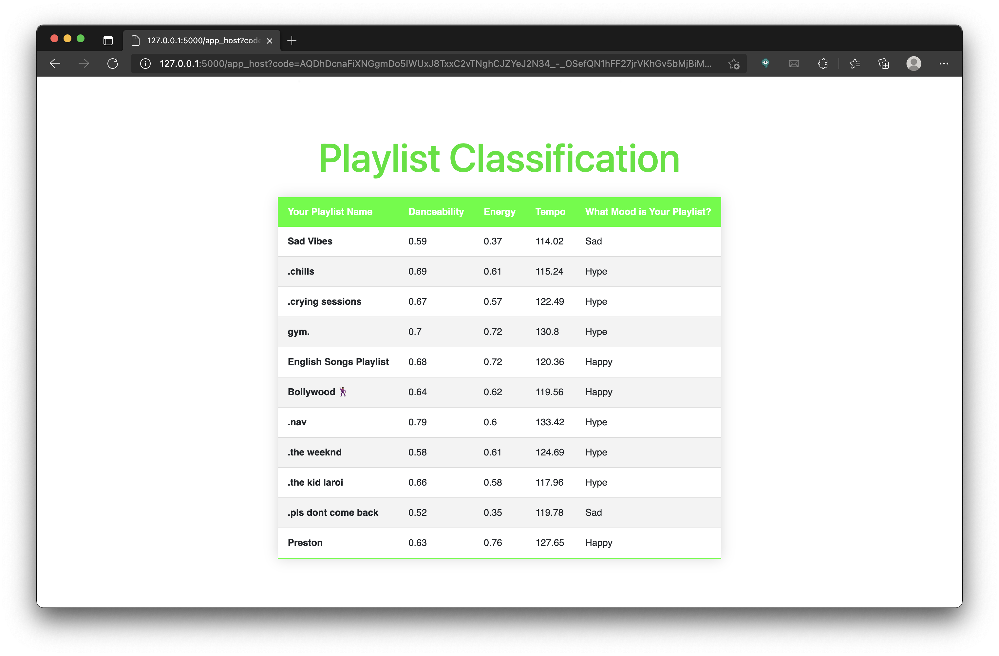
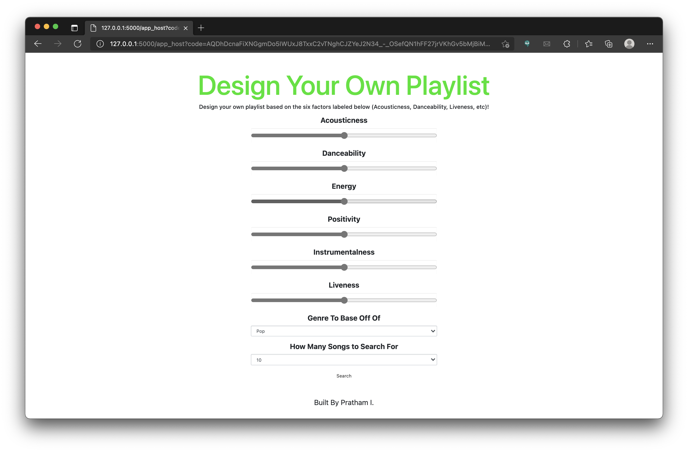
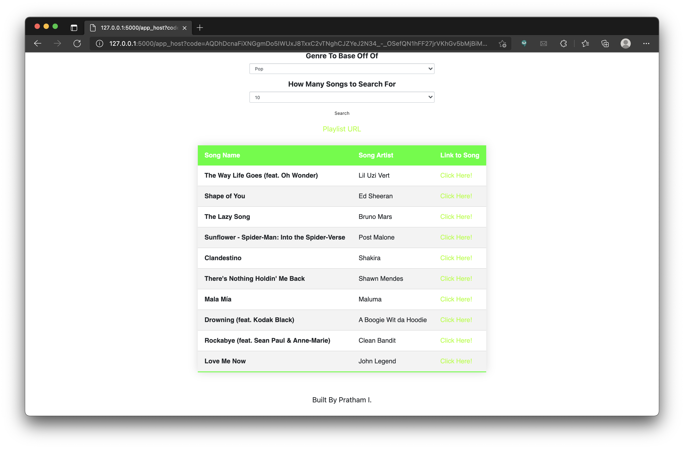
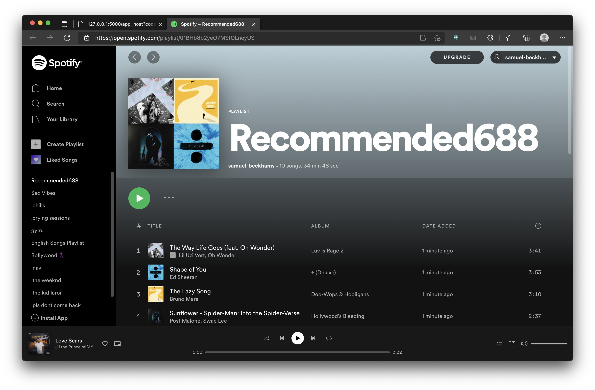

# Spotify Analysis 🎵
An analysis of one's Spotify Account with the use of their listening habits. Built with HTML + Flask, it provides rich playlist information, curates a playlist based on specific factors, and predicts one's mood based on their music listening habits.

## How it works
Utilizing both the Spotify API along with Google's NLP API, this application can generate a better emotion classifier, as well as providing visualizations on user's insights with a fresh prespective. 

### Authentication
When the user first visits the web application, they are prompted to link their Spotify account. During this process, the backend portion of the app generates a JSON header to send to Spotify's server. This authentication token permits the service to access the user's account for the duration of one browser session, so if the user refreshes the page, the application keeps the token alive with the use of a refresh token (in order to convey to Spotify that the session was still logged in). 

### Mood Detection
Once the user logs in to their Spotify account and grants all of the necessary permissions, they view a dashboard pre-populated with the user's current mood, as well as the respective mood of each playlist in their library. The generation of these metrics involve multiple steps, outlined below:
- ***Lyric Sentiment Analysis*** - For any set of songs that were being analyzed (whether it be the user's most recent playlist or their last 50 songs), the program fetched the lyrics for all the songs in question (with the use of the Genius API). After retrieving these lyrics, the program called Google's Natural Language Processing API in order to perform sentiment analysis on these words. With the use of these calculations, the program devised a score based on soley the lyrics, one key metric utilized in calculating the final score.
- ***Spotify's Data*** - Spotify's API provides a variety of song data itself, so the program fetched the data from the API in order to use a song's happiness, tempo, valence, danceability, and a couple of other metrics to calculate another score for the song based soley on spotify data.
- ***Mood Vector*** - After training with over 100 songs that classified each mood, and performing the calculations mentioned above on all of these songs, we used this trained dataset to create a baseline mood vector for each of these moods
- ***Classifying a Song's Mood*** When retrieving a song's specific vector, the program performs an error analysis of this vector (essentially comparing it to the standard vectors mentioned above). The vector that has the least amount of errors is then declared the mood of that song.

### Playlist Curation
When a user is feeling a paticular mood, they typically want to listen to music that fits their specifc taste at that time. Due to this, the program implements a feature that allows the user to input specific metrics they are interested in listening to (such as danceability, tempo, happiness, etc.) at the moment. After submitting these specific metrics, the program generates a playlist with a configurable amount of songs (up to 100) that satisfies the user's requriements. Along with providing a URL to the playlist and each specific song (with their mood scores as well), the program automatically adds the playlist to the user's Spotify account so that they can start listening immeddiately. 

## Application in Action 
Here are screenshots of the application in action, showcasing its functionality.

Here is an image of the user's dashboard, after they have logged into their Spotify Account.

Here is an image of the user's current mood being displayed on the application.

Here is an image of the user's mood history, plotted on a graph.

Here is an image of the user's playlist classification (the specific metrics calculated by the program for each of their playlists), along with an overall score for their mood.

Here is an image of the playlist curation feature implemented. As you can see, the user can input various levels of danceability, tempo, happiness, etc. in order to curate a playlist perfect to their taste based on their mood at the moment.

Here is an image of the playlist that the program curated for the user's paticular mood, along with a link to each song and the playlist as a whole. 

Here is an example of the playlist being added to the user's Spotify account automatically, in favor of convenience for the user.

